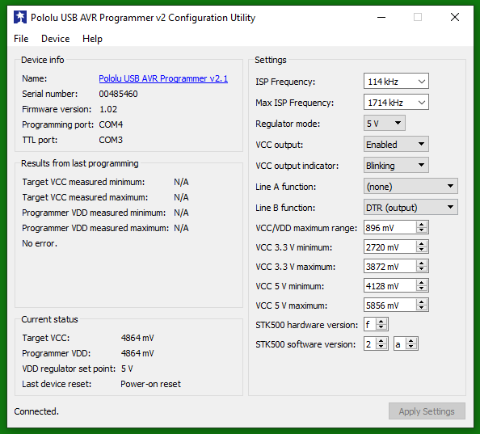
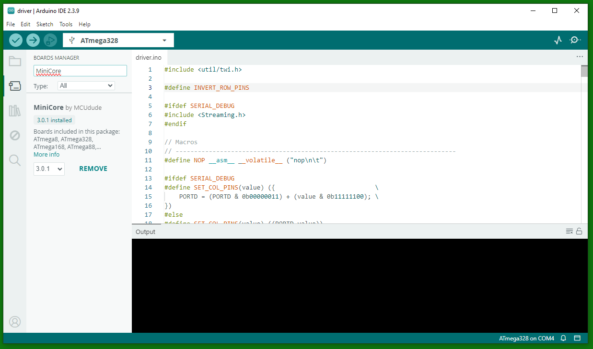
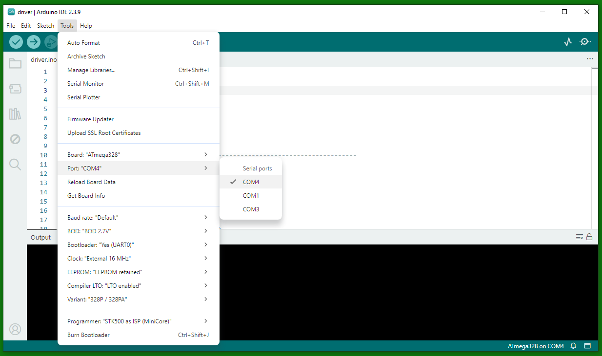
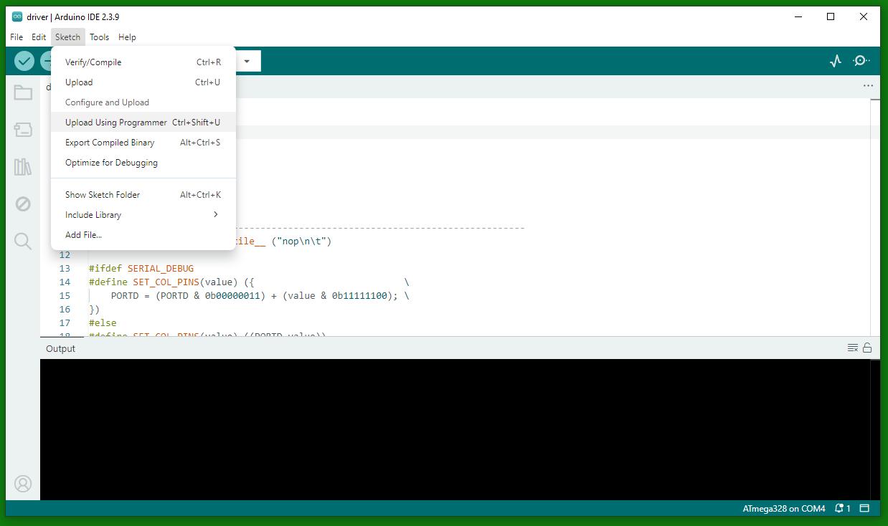

Software running on microcontroller units (MCUs) is considered firmware. This document guides you from obtaining the hardware to making the comm and driver panels work. Note that there are two different ways to upload the firmware: one for the [latest driver and comm board](#firmware-new) (driver v1.9 and comm >v0.4) and one for the older versions.

1. TOC
{:toc}

# Firmware {#firmware-new}

The [driver]({{site.baseurl}}/Generation%204/Panel/docs/driver.html) and [comm board]({{site.baseurl}}/Generation%204/Hardware/docs/comm.html) use a total of five microcontroller units (MCUs). To program these five ATmega328s, you will need the [programmer]({{site.baseurl}}/Generation%204/Hardware/docs/programmer.html) explained in the [acquisition]({{site.baseurl}}/docs/g4_acquisition.html) step.

## Prerequisites

You will need the following parts:

- [driver board v1.9]({{site.baseurl}}/Generation%204/Panel/docs/driver.html)
- [comm board >=v0.4]({{site.baseurl}}/Generation%204/Hardware/docs/comm.html)
- [Pololu USB AVR Programmer v2.1](https://www.pololu.com/product/3172) + [Software](https://www.pololu.com/product/3172/resources)
- [driver board shield]({{site.baseurl}}/Generation%204/Hardware/docs/programmer.html#driver)
- [comm board shield]({{site.baseurl}}/Generation%204/Hardware/docs/programmer.html#comm)
- [Arduino IDE](https://www.arduino.cc/en/software/)

{:.ifr .pop}

Using the Pololu USB AVR software, configure the Pololu with the following parameters. Most notably, switch the regulator mode to 5V and set the VCC output to "Enabled".

{:.ifr .pop}

In the Arduino IDE, you will need to install the MiniCore board package. To do this, go to the Board Manager (Tools → Board → Boards Manager) and search for "MiniCore". Install the latest version of the package.

## Flashing firmware to the latest driver and comm board

{:.ifr .pop}

Connect either the driver or comm board via the matching shield to the Pololu USB AVR Programmer. For the driver shield, select the quadrant you want to program first via the dip switch on the programmer. Connect the Pololu USB AVR Programmer to your computer via USB. Select the COM port that is shown as "Programming port" in the Pololu USB AVR software or, if you don't have that software, select the COM port with the higher number, which is usually the programming port. Select all other options similar to what is shown in the screenshot, such as the Board (ATmega328), the Programmer (STK500 as ISP (MiniCore)), Variant (328P / 328PA), etc. Then click "Burn Bootloader" to flash the bootloader to the driver or comm board. You should see a success message in the Arduino IDE.

{:.ifr .pop}

Load the correct sketch (either comm.ino or driver.ino) in the Arduino IDE and click "Sketch" → "Upload Using Programmer" to flash the firmware to the driver or comm board. You should see a success message in the Arduino IDE.

# Older firmware {#firmware-old}

For the older drivers and comm boards, we used an Arduino as an ["In-circuit Serial Programmer" (ISP)](#isp) to flash the firmware to [the driver](#driver-old) and the [comm board](#comm-old).

## Prerequisites

You will need the following parts:

- [driver board]({{site.baseurl}}/Generation%204/Panel/docs/driver.html)
- [comm board]({{site.baseurl}}/Generation%204/Hardware/docs/comm.html)
- [Arduino]({{site.baseurl}}/docs/g4_off-the-shelf.html#arduino-uno)
- [Arduino shield]({{site.baseurl}}/Generation%204/Hardware/docs/programmer.html#arduino)
- [driver board shield]({{site.baseurl}}/Generation%204/Hardware/docs/programmer.html#driver)
- [comm board shield]({{site.baseurl}}/Generation%204/Hardware/docs/programmer.html#comm)
- (Windows) computer

Install the [custom version of the Arduino IDE](https://github.com/floesche/panels_g4_firmware/releases/download/arduino-1.6.5-r5/arduino-panelsg4-1.6.5-r5.zip) on your computer. This IDE has the PanelsG4 board added as a target. The Windows version of Arduino-1.6.5 is provided as an asset to the "Customized Arduino IDE" release on GitHub.

{::comment}
TODO: Possibly provide alternative
{:/comment}

## Turn Arduino into In-circuit Serial Programmer (ISP) {#isp}

To flash the firmware to the panel MCUs, the Arduino will act as a programmer. For this, the Arduino requires special firmware, which is provided as "example" code. Follow these steps to turn the Arduino into an ISP.

1. Connect the Arduino (make sure the programmer shield is off, as it will prevent programming).
1. Open the Arduino IDE.
1. Go to *Tools*{:.gui-txt} ­→ *Board*{:.gui-txt} and select *Arduino UNO*{:.gui-txt}.
1. Go to *Tools*{:.gui-txt} ­→ *Port*{:.gui-txt} and select the correct port.
1. Go to *File*{:.gui-txt} ­→ *Examples*{:.gui-txt} and select *ArduinoISP*{:.gui-txt}.
1. *Verify*{:.gui-btn} (check button) and *Upload*{:.gui-btn} (right point arrow button).

These steps should be similar to what is described in an [Arduino tutorial online](https://www.arduino.cc/en/Tutorial/BuiltInExamples/ArduinoISP).

## Troubleshooting

There is no verbose output that helps with debugging problems, but one of the following three steps has solved most problems in the past:

1. Make sure that the Arduino firmware has not been corrupted. [Flashing the ISP firmware to the Arduino](#isp) again solved many unexplained problems.
1. Make sure your driver and comm boards are connected in the correct way. It's easy to mix up the polarity, which, in the worst case, can corrupt a panel but is often solved by using the correct polarity.
1. Make sure only one subdevice is selected on the [driver board](#driver-old). Multiple selections can lead to unexpected results.

# Programming an older comm panel {#comm-old}

Each [comm board](../../Hardware/docs/comm.md) needs to be programmed.

The following has to be done only once for all comm boards: In the Arduino IDE, go to *Tools*{:.gui-txt} ­→ *Board*{:.gui-txt} and select *PanelG4*{:.gui-txt}. In *Tools*{:.gui-txt} ­→ *Programmer*{:.gui-txt}, you need to select *Arduino as ISP*{:.gui-txt} (not ArduinoISP).

## Connect comm board

{:.ifr .pop}

To program the ATmega328 on a comm board, connect the board to the comm shield board in a way that you can see the components on both boards (also see image). There is no need to connect the external power supply; power is provided through the Arduino shield.

## Flash comm board firmware

Once the comm board is attached to the comm shield, you can connect the comm shield to the Arduino shield with the ribbon cable. Make sure to disconnect the ribbon cable when changing the comm boards.

With the Arduino IDE open, select *Tools*{:.gui-txt} ­→ *Burn Bootloader*{:.gui-txt} to write the boot loader to the comm board's MCU. With the correct `comm.ino` open (the latest version is in the GitHub repository linked to this page (see link in the bottom left of the page) at `hardware_v0p2/comm/`), select *Sketch*{:.gui-txt} ­→ *Upload Using Programmer*{:.gui-txt}. Now the comm board should be fully functional. Disconnect the ribbon cable before programming the next comm board.

## Checklist for flashing comm firmware

1. Connect Arduino shield to the computer[^1]
1. Open Arduino IDE
1. Go to *Tools*{:.gui-txt} ­→ *Board*{:.gui-txt} and select *PanelG4*{:.gui-txt}
1. Go to *Tools*{:.gui-txt} ­→ *Programmer*{:.gui-txt} and select *Arduino as ISP*{:.gui-txt} (not ArduinoISP!!!)
1. Disconnect ribbon cable between comm shield board and Arduino shield
1. Attach comm board to the comm shield board
1. Connect the comm shield board to Arduino shield via ribbon cable[^2]
1. Go to *Tools*{:.gui-txt} ­→ *Burn Bootloader*{:.gui-txt}
1. Open the `comm.ino` sketch
1. Go to *Sketch*{:.gui-txt} ­→ *Upload Using Programmer*{:.gui-txt} to upload the sketch to the comm board
1. For the next comm board, continue at step 5

# Programming an older driver panel {#driver-old}

The following steps have to be done for each individual driver board. This applies to all driver versions except the most recent v1.9.

The following has to be done only once for all driver boards: In the Arduino IDE, go to *Tools*{:.gui-txt} ­→ *Board*{:.gui-txt} and select *PanelG4*{:.gui-txt}. In *Tools*{:.gui-txt} ­→ *Programmer*{:.gui-txt}, you need to select *Arduino as ISP*{:.gui-txt} (not ArduinoISP).

## Connect driver board

{:.ifr .pop}

The first step is to connect the [driver board]({{site.baseurl}}/Generation%204/Panel/docs/driver.html) to the [driver board shield]({{site.baseurl}}/Generation%204/Hardware/docs/programmer.html#driver). The correct orientation of the driver is when the two triangles printed on the board point away from the connector (up in the picture). This also means that the upper edge of the shield and the driver are well aligned and the lower edge of the driver aligns with the printed line on the shield. Make sure you double-check the orientation, as there is a chance of breaking the driver. There is no need to connect the external power supply; power is provided through the Arduino shield.

## Flash driver board firmware

{:.ifr .pop}

Once the driver is attached to the driver shield, you can connect the driver shield to the Arduino shield with the ribbon cable. Make sure to disconnect the ribbon cable when changing the driver board.

Select one of the four subdevices to be programmed by moving one of the dip switches away from the panel and the other three towards the panel. In the picture on the right, subdevice number 4 is selected through the dip switch on the left. Select *Tools*{:.gui-txt} ­→ *Burn Bootloader*{:.gui-txt} to write the boot loader to the ATmega328. With the correct `driver.ino` sketch opened, select *Sketch*{:.gui-txt} ­→ *Upload Using Programmer*{:.gui-txt} to upload the sketch to the panel. Currently, the latest version of the driver sketch is in the associated GitHub repository (see link in the bottom left of the page) at `hardware_v0p2/driver/`.

Repeat the steps for "Flash driver board firmware" for the other three subdevices on the same driver panel.

## Checklist for flashing driver firmware

1. Connect Arduino shield to the computer[^1]
1. Open Arduino IDE
1. Go to *Tools*{:.gui-txt} ­→ *Board*{:.gui-txt} and select *PanelG4*{:.gui-txt}
1. Go to *Tools*{:.gui-txt} ­→ *Programmer*{:.gui-txt} and select *Arduino as ISP*{:.gui-txt} (not ArduinoISP!!!)
1. Connect a driver board to the driver shield board[^2]
1. Connect driver shield to the Arduino shield via ribbon cable[^1]
    1. Select the subdevice using the dip switch. Away from the panel means "on"; only one should be up at a time[^3].
    1. Go to *Tools*{:.gui-txt} ­→ *Burn Bootloader*{:.gui-txt}
    1. Open the `driver.ino` sketch
    1. Go to *Sketch*{:.gui-txt} ­→ *Upload Using Programmer*{:.gui-txt} to upload the sketch to the panel.
    1. Repeat from step a) for the other subdevices
1. Disconnect ribbon cable
1. Repeat from step 5 for each driver board

---

[^1]: Always remove the ribbon cable before removing and attaching a new driver subpanel, as attaching a panel without doing so will sometimes corrupt the ArduinoISP program on the Arduino Uno.

[^2]: Note, you do not need an external power supply; the Arduino will provide power.

[^3]: To fully program the driver, you need to program all four ATmega328s, which means programming the bootloader and firmware for all four dip switch "on" positions, one at a time.
